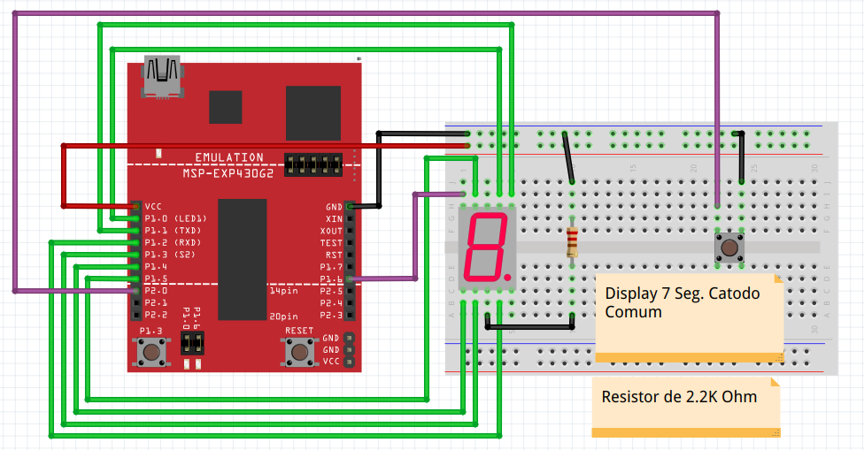

# 
 **Sistemas Microcontrolados** 

 Turma 2022-1 UTFPR-PB 

 Luiz Henrique A. Vigiato 

 Microcontrolado MSP2553 

-------------------------------------

- ## **Contador com display 7 segmentos**

Utilizando um display 7 segmentos criar um contador que inicia do 0 vai ate 9, e apos reinicia a contagem. Tempo entre cada contagem de 1 segundo utilizando clock. **Pasta:** _(contador_7seg)_

-------------------------------------

- ## **Incrementador display 7 seg. com botao**

Utilizando um display 7 segmentos criar um contador que a cada vez que o botao e apertado incrementa no display. Inicia-se o display em 0 e ao chegar ao 9 reinicia a contagem. **Pasta:** _(incrementador_7seg_botao)_

-------------------------------------

<!-- - ## **Incrementador e decrementador display 7 seg. com botoes** -->