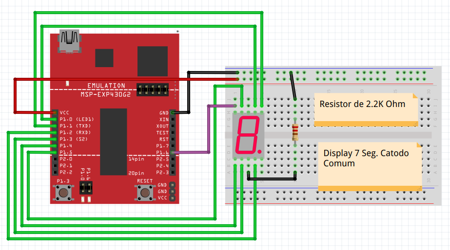

# 
 **Sistemas Microcontrolados** 

 Turma 2022-1 UTFPR-PB 

 Luiz Henrique A. Vigiato 

 Microcontrolado MSP2553 

-------------------------------------

- ## **Contador com display 7 segmentos**

    Utilizando um display 7 segmentos criar um contador que va de 0 ate 9. Alternando entre cada estado uma vez por segundo utilizando o clock de 32769 Hz do cristal auxiliar.

1. MSP42553.
2. Display 7 segmentos catodo comum.
3. Resistor de 2,2k Ohm.
3. Fios para conexao.

 - O valor inicial deve ser de 0.
 - Apos chegar o 9 devera reiniciar o contador

